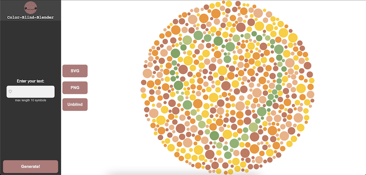
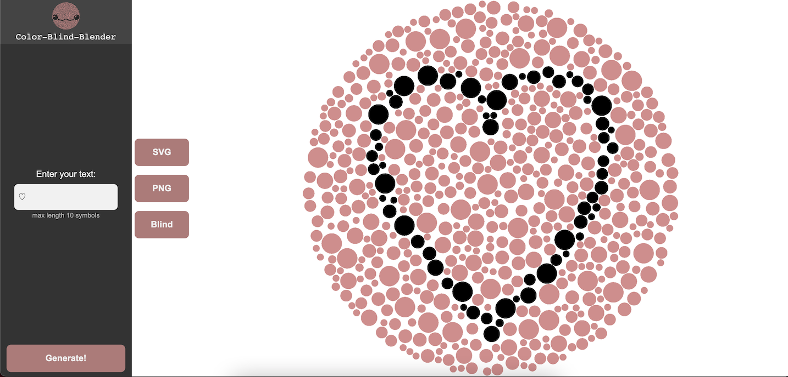

# Hello!

This project was created exclusively just for fun. If you have color blind friends (red-green) and want to give them a funny picture T-shirt, create an SVG template in two clicks.

**[TRY IT OUT](https://lunarlynx.github.io/color-blind-joke/)**

#### Example of the generated image (you may try unicode):

#### In case if you don't see the symbol, it is the unblind version:

download template in:
#### svg
#### png

### Warning!
Your color blind friends are unlikely to appreciate this joke.

## Running the application locally

In the project directory, you can run:

### `yarn install`
### `yarn start`

Runs the app in the development mode.\
Open [http://localhost:3000](http://localhost:3000) to view it in the browser.

The page will reload if you make edits.\
You will also see any lint errors in the console.

## Authors
@anstarovoyt\
@lunarlynx
